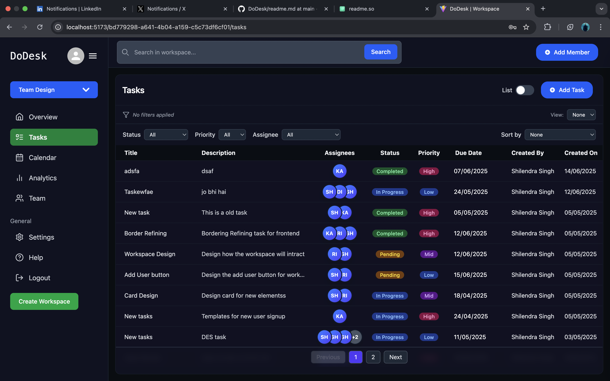
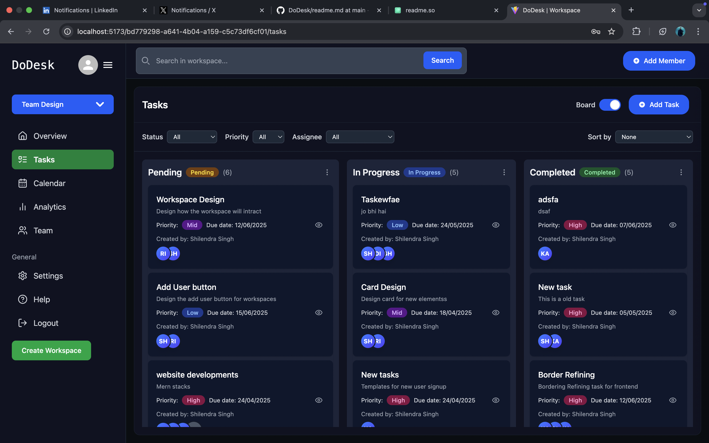

# 🖥️ DoDesk – Collaborative Workspace Tool

DoDesk is a full-stack task management and collaboration tool designed to help teams stay productive, organized, and efficient — built with the PERN stack (PostgreSQL, Express, React, Node.js).

Inspired by tools like Notion, Trello, and Asana — but fully custom-built from scratch.

---




## 🚀 Features

### ✅ Authentication & Workspace Setup
- JWT-based login system
- Only admins can create workspaces
- Auto-assignment of workspace creator as `admin` in `workspace_members`

### 🧱 Workspace Management
- Create, switch, and list workspaces
- Invite members via email (Nodemailer + Gmail SMTP)
- View all joined members within each workspace

### 🗂️ Task Management
- Create, edit, and delete tasks
- Set task priority, due date, and status
- Assign tasks to workspace members
- Real-time task editing and state syncing

### 🧩 Kanban Board (Drag & Drop)
- Built using `@hello-pangea/dnd`
- Tasks grouped by status: `Pending`, `In Progress`, `Completed`
- Drag-and-drop support to update status instantly
- Modular components: `TaskBoardView.jsx`, `TaskColumn.jsx`

### 🎯 Task Filtering & Sorting
- Filter tasks by priority and status
- Sort tasks by due date and priority
- Saved filter context (React Context API)

### 📝 Inline Editing
- Edit task title and description directly in the table
- Controlled components with `onBlur` + live API updates
- Visual feedback with toast notifications

### 🧠 Task Drawer
- Slide-in panel for detailed task view/edit
- Update title, description, status, priority, due date, and assignees
- Add/remove task assignees with API integration

### 📦 UI & UX
- Responsive layout using Tailwind CSS
- Sticky pagination
- Tooltips with blur effects
- Smooth modal and drawer animations
- Dark theme UI (`#10141a`, `#1a1f2e`, green buttons)

---

## 🛠️ Tech Stack

- **Frontend**: React, Tailwind CSS, Axios, @hello-pangea/dnd, React Context API
- **Backend**: Node.js, Express.js, PostgreSQL, Knex.js
- **Email**: Nodemailer + Gmail SMTP
- **Other Tools**: React Hot Toast, Lucide Icons

---

## 🔧 Setup Instructions


### 1. Configure Environment Variables
```env
PORT=YOUR_PORT
DB_USER=your_Db
DB_HOST=hostname
DB_NAME=dbname
DB_PASSWORD=dbpassword
DB_PORT=dbport
JWT_SECRET=jwtsecrettoken
RESEND_API_KEY=yourresendapikey
```
---

### 2. migration
```
npx knex migrate:latest
```
---

### 3. Clone the Repository

```bash
git clone https://github.com/your-username/dodesk.git
cd dodesk

---

